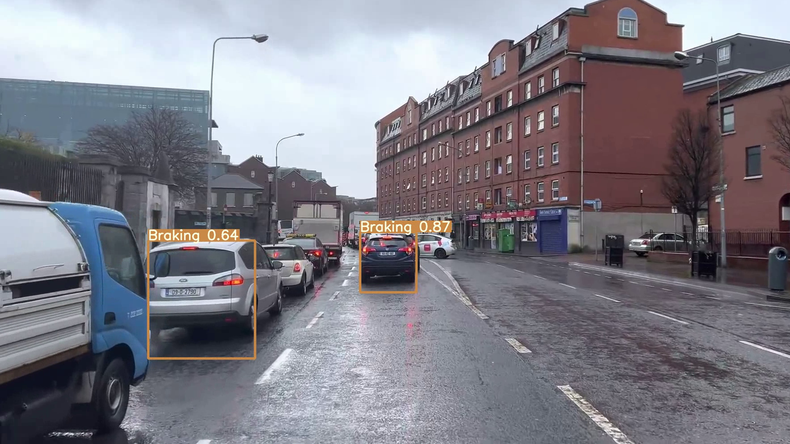

# YOLOv7-Braking-Detection

This is a project to Train YOLOv7 to detect the vehicle braking light status for preemptive braking using a custom dataset. 

The aim of this project is to aid the ADAS/Autonomous vehicles to predict and prepare for the braking even before the leading vehicle speed changes are detected by the radar. Even placing the foot on the brake pedal will convey the leading driver's intent to brake allowing the following vehicle to recalibrate and readjust it's distance and speed even before the leading vehicle actually starts slowing down. This might be helpful to heavy vehicles such as trucks with long stopping distance and might prevent accidents that occur from sudden hard braking.

Further details also at: https://medium.com/@armaan.sandhu.2002/e8e7e9db1b3b

## Files

This repository contains the following files used to build and run the project:

1. [YOLOv7_Braking_Detection.ipynb](https://colab.research.google.com/drive/1uxMoyABEvXf6MOd2j0zMawT4u_xrbEKz?usp=sharing): This is the main file that details the steps and commands to download, setup, train and test YOLOv7 on a custom dataset.
2. [Dataset_Prep.ipynb](https://colab.research.google.com/drive/1HMgSZYyB3FT-9LmTVFBHszsHEg7h-Dk8?usp=sharing): This file details the steps and the custom code to automate the preparing, preprocessing, augmention and splitting of the dataset.

Detailed steps on how to install, setup and use can be found in these files. 

## Training Results

The best results were observed after training for 40 epochs as further training led to overfitting and increase in objectness losses.

## Evaluation

Inference was performed images and videos sourced from the internet. More details can be found in the [YOLOv7_Braking_Detection.ipynb](https://colab.research.google.com/drive/1uxMoyABEvXf6MOd2j0zMawT4u_xrbEKz?usp=sharing) file.

Videos of Normal weather conditions and Bad weather were used. They are as follows:

### 1. Normal weather conditions

### 2. Bad weather conditions

 
Following are the results of Inference performed on images (Please click the images to enlarge):
  

  
  
  
  

## Future Enhancements

The dataset and training needs to be enhanced to incorporate other vehicle classes such as bikes and heavy vehicles and various scenarios such as night driving, low lighting conditions and glares and disruptions. Also the detection of turn signals needs to be incorporated. The model performance on realtime data will also be tested. A lighter model can be trained and optimized for testing and deployment on edge devices. A future project might entail combining YOLO for detection and a classifier trained on this dataset for classification. The combination can be also used to generate an enhanced and annotated YOLO dataset.

## Credits

- Backgrounds Dataset: Houben, S., Stallkamp, J., Salmen, J., Schlipsing, M., & Igel, C. (2013, August). Detection of traffic signs in real-world images: The German Traffic Sign Detection Benchmark. In The 2013 international joint conference on neural networks (IJCNN) (pp. 1-8). Ieee. [[link]](https://sid.erda.dk/public/archives/ff17dc924eba88d5d01a807357d6614c/published-archive.html)
- Rear Signal dataset: Hsu, H. K., Tsai, Y. H., Mei, X., Lee, K. H., Nagasaka, N., Prokhorov, D., & Yang, M. H. (2017, October). Learning to tell brake and turn signals in videos using cnn-lstm structure. In 2017 IEEE 20th International Conference on Intelligent Transportation Systems (ITSC) (pp. 1-6). IEEE. [[Link]](http://vllab1.ucmerced.edu/~hhsu22/rear_signal/rear_signal)
- [YOLOv7 Official Repository](https://github.com/WongKinYiu/yolov7)

## Connect

**Armaan Sandhu**

- [Github](https://github.com/ArmaanSinghSandhu)
- [LinkedIn](https://www.linkedin.com/in/armaan-s-sandhu/)
- [YouTube](https://www.youtube.com/channel/UC2SckjYwSYGw2j3yp9ZakeA)
